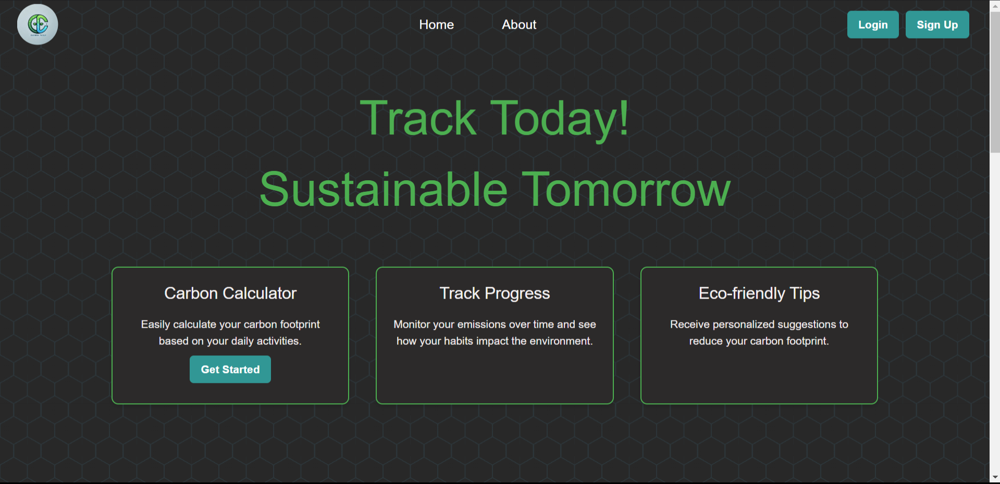
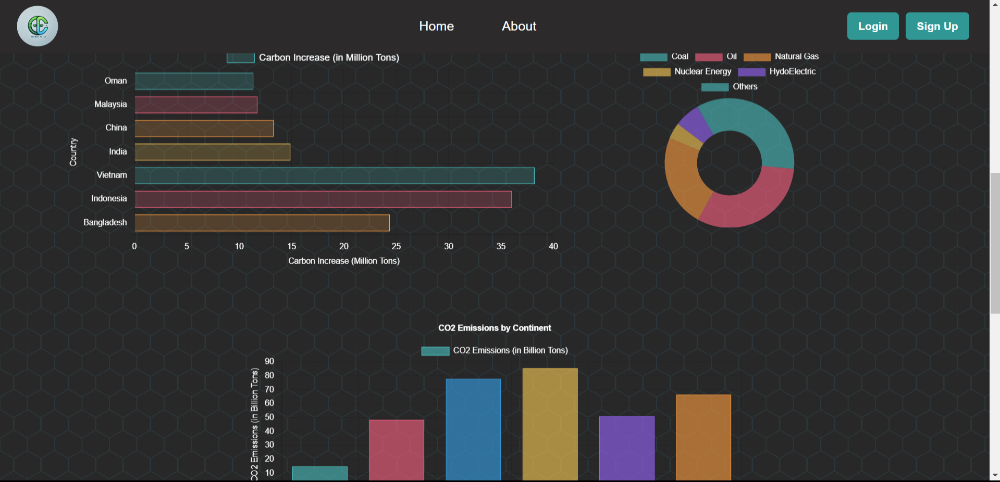
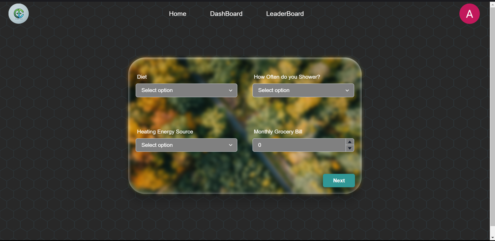
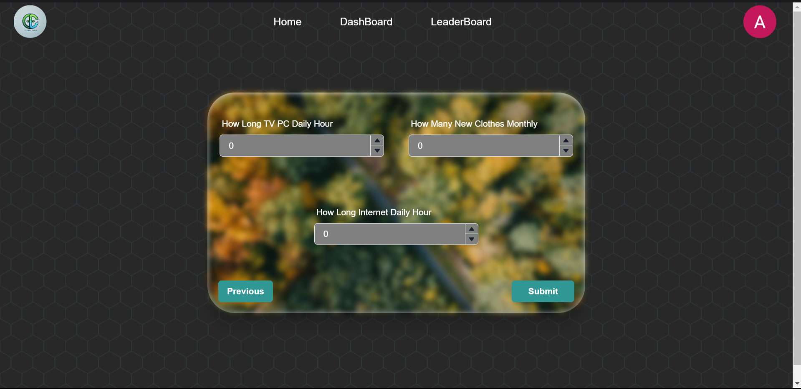
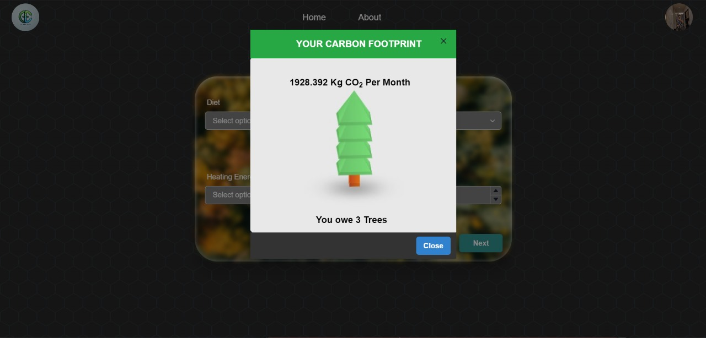
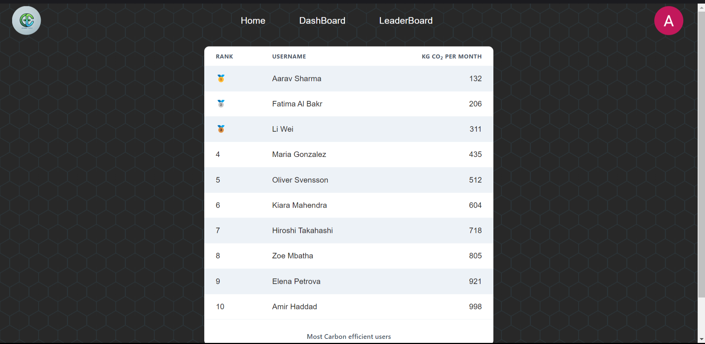

# CodeTally 🌳
**Track today, sustain tomorrow**

CodeTally is a webstie that uses a xgboost model to predict the carbon emitted by a person per month. This website provides a seamless UI that enables users to track their carbon emission , get tips and provides a local leaderboard that shows the carbon emissions of people in a locality. In this way we aim to promote people to produce less carbon and greenhouse gasses by providing incentives to best performers

# User Interface

1. Landing page





2. Check Carbon Footprint




3. Carbon Footprint prediction



3. Leaderboard



    
# Tech Stack 🚀

1. React+Vite (frontend)
2. Firebase (authentication+storage)
3. Flask (backend)
4. PyTorch and sckit-learn (making model)

# Local Installation 🤖

1. Clone the repository in your local device
2. Start the backend
    ```bash
    cd backend
    pip install -r requirements.txt
    python app.py
    ```
3. Start the frontend
    ```bash
    cd Nasa
    npm install
    npm run build
    npm run dev
    ```
4. After Running both frontend and backend go to the http://localhost:5173/ to view the website

# Environment Variables

Make sure to define any required environment variables for both services (e.g., database credentials, API keys).
